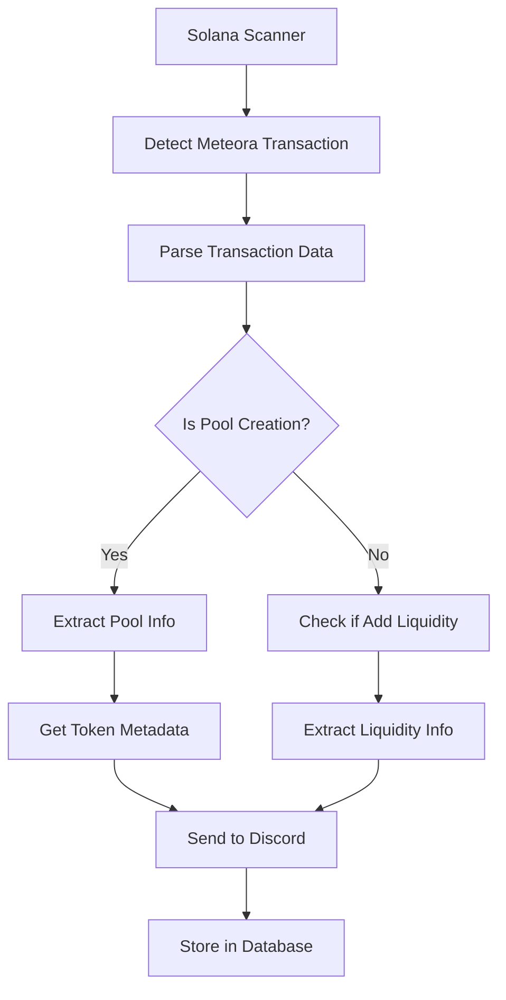

# Meteora Pool Detection Implementation Guide

## Overview

This guide explains how to implement Meteora pool detection as an alternative to generic token scanning. Meteora is a leading automated market maker (AMM) on Solana that creates liquidity pools for token pairs.

## Why Meteora Pool Detection?

### Advantages over Generic Token Scanning:

- **Higher Signal-to-Noise Ratio**: Meteora pools indicate actual trading activity and liquidity
- **Better Quality Tokens**: Tokens with Meteora pools are more likely to be legitimate projects
- **Immediate Liquidity Information**: You get pool data, liquidity amounts, and trading pairs
- **Lower False Positives**: Reduces spam tokens and test tokens
- **Trading Ready**: Pools are immediately tradeable through Meteora's interface

### Use Cases:

- Detect new token launches with immediate liquidity
- Monitor pool creation for established tokens
- Track liquidity additions to existing pools
- Identify high-volume trading opportunities

## Meteora Program Information

### Program ID

```
LBUZKhRxPF3XUpBCjp4YzTKgLccjZhTSDM9YuVaPwxo
```

### Key Instruction Types

1. **initializeCustomizablePermissionlessLbPair** - Creates new liquidity bootstrap pools
1. **initializeCustomizablePermissionlessLbPair2** - Creates new liquidity bootstrap pools

## Implementation Architecture

### 1. Scanner Configuration

Update your scanner to monitor Meteora's program ID instead of generic token programs:

```go
// Update your config.yaml or environment variables
solana:
  program_ids:
    - LBUZKhRxPF3XUpBCjp4YzTKgLccjZhTSDM9YuVaPwxo  # Meteora Program
  scan_interval: 1s
  confirmation_level: confirmed
```

### 2. Transaction Detection Flow



### 3. Transaction Parsing Strategy

Based on your existing code, here's how to adapt it for Meteora pools:

```go
// Update ParseTransaction function
func ParseMeteoraTransaction(txData *types.RPCResponse) (*MeteoraPoolInfo, error) {
    // Look for specific Meteora instructions
    for _, instruction := range txData.Result.Transaction.Message.Instructions {
        if isMeteoraInstruction(instruction, txData.Result.Transaction.Message.AccountKeys) {
            return parseMeteoraInstruction(instruction, txData)
        }
    }
    return nil, fmt.Errorf("no Meteora pool instruction found")
}
```

## Data Structures

### Pool Information Structure

```go
type MeteoraPoolInfo struct {
    PoolAddress     string    `json:"pool_address"`
    TokenAMint      string    `json:"token_a_mint"`
    TokenBMint      string    `json:"token_b_mint"`
    TokenASymbol    string    `json:"token_a_symbol"`
    TokenBSymbol    string    `json:"token_b_symbol"`
    CreatorWallet   string    `json:"creator_wallet"`
    PoolType        string    `json:"pool_type"` // "LB" or "Permissionless"
    InitialLiquidity struct {
        TokenA uint64 `json:"token_a_amount"`
        TokenB uint64 `json:"token_b_amount"`
    } `json:"initial_liquidity"`
    FeeRate         uint64    `json:"fee_rate"`
    CreatedAt       time.Time `json:"created_at"`
    TransactionHash string    `json:"transaction_hash"`
    Slot            uint64    `json:"slot"`
}

type MeteoraEvent struct {
    Type        string           `json:"type"` // "pool_created", "liquidity_added"
    PoolInfo    *MeteoraPoolInfo `json:"pool_info"`
    EventData   interface{}      `json:"event_data"`
    BlockTime   time.Time        `json:"block_time"`
    Signature   string           `json:"signature"`
}
```

## Account Position Analysis

### Understanding Meteora Instruction Accounts

For `initializeCustomizablePermissionlessLbPair`:

| Account Index | Description                |
| ------------- | -------------------------- |
| 0             | Fee payer (creator wallet) |
| 1             | LB Pair account            |
| 2             | Token X mint               |
| 3             | Token Y mint               |
| 4             | Reserve X                  |
| 5             | Reserve Y                  |
| 6             | Token X program            |
| 7             | Token Y program            |
| 8             | System program             |
| 9             | Rent sysvar                |
| 10+           | Additional accounts        |

### Parsing Strategy

```go
func parseMeteoraPoolCreation(instruction types.Instruction, accountKeys []string) (*MeteoraPoolInfo, error) {
    if len(instruction.Accounts) < 10 {
        return nil, fmt.Errorf("insufficient accounts for pool creation")
    }

    return &MeteoraPoolInfo{
        CreatorWallet:   accountKeys[instruction.Accounts[0]],
        PoolAddress:     accountKeys[instruction.Accounts[1]],
        TokenAMint:      accountKeys[instruction.Accounts[2]],
        TokenBMint:      accountKeys[instruction.Accounts[3]],
        PoolType:        "Permissionless",
        TransactionHash: "", // Set from transaction signature
    }, nil
}
```

## Integration with Existing System

### 1. Update Scanner Service

```go
// internal/adapters/solana/meteora_scanner.go
type MeteoraScanner struct {
    config     *config.Config
    logger     logger.Logger
    rpcClient  *rpc.Client
    grpcClient pb.SnipingServiceClient
}

func (s *MeteoraScanner) processMeteoraTransaction(tx *rpc.TransactionWithMeta) {
    // Parse Meteora-specific data
    poolInfo, err := ParseMeteoraTransaction(tx)
    if err != nil {
        s.logger.WithError(err).Debug("Failed to parse Meteora transaction")
        return
    }

    // Enrich with token metadata
    poolInfo.TokenASymbol = s.getTokenSymbol(poolInfo.TokenAMint)
    poolInfo.TokenBSymbol = s.getTokenSymbol(poolInfo.TokenBMint)

    // Send to gRPC server
    s.sendMeteoraEvent(poolInfo)
}
```

### 2. Update gRPC Protocol

Add new message types to your proto file:

```protobuf
// api/proto/meteora.proto
message MeteoraPoolInfo {
    string pool_address = 1;
    string token_a_mint = 2;
    string token_b_mint = 3;
    string token_a_symbol = 4;
    string token_b_symbol = 5;
    string creator_wallet = 6;
    string pool_type = 7;
    uint64 fee_rate = 8;
    google.protobuf.Timestamp created_at = 9;
    string transaction_hash = 10;
    uint64 slot = 11;
}

message MeteoraEvent {
    string event_type = 1;
    MeteoraPoolInfo pool_info = 2;
    google.protobuf.Timestamp block_time = 3;
    string signature = 4;
}

// Add to your service
service SnipingService {
    rpc ProcessMeteoraEvent(MeteoraEvent) returns (ProcessResponse);
}
```

### 3. Update Discord Notifications

```go
// internal/adapters/discord/meteora_notifier.go
func (d *DiscordBot) SendMeteoraPoolNotification(poolInfo *MeteoraPoolInfo) error {
    embed := &discordgo.MessageEmbed{
        Title: "🌊 New Meteora Pool Created",
        Color: 0x00D4AA, // Meteora brand color
        Fields: []*discordgo.MessageEmbedField{
            {
                Name:   "Pool Pair",
                Value:  fmt.Sprintf("%s/%s", poolInfo.TokenASymbol, poolInfo.TokenBSymbol),
                Inline: true,
            },
            {
                Name:   "Pool Address",
                Value:  fmt.Sprintf("`%s`", poolInfo.PoolAddress),
                Inline: false,
            },
            {
                Name:   "Creator",
                Value:  fmt.Sprintf("`%s`", poolInfo.CreatorWallet),
                Inline: true,
            },
            {
                Name:   "Pool Type",
                Value:  poolInfo.PoolType,
                Inline: true,
            },
        },
        Footer: &discordgo.MessageEmbedFooter{
            Text: fmt.Sprintf("Slot: %d", poolInfo.Slot),
        },
        Timestamp: poolInfo.CreatedAt.Format(time.RFC3339),
    }

    // Add action buttons
    components := []discordgo.MessageComponent{
        discordgo.ActionsRow{
            Components: []discordgo.MessageComponent{
                discordgo.Button{
                    Label: "View on Meteora",
                    Style: discordgo.LinkButton,
                    URL:   fmt.Sprintf("https://app.meteora.ag/pools/%s", poolInfo.PoolAddress),
                },
                discordgo.Button{
                    Label: "View Transaction",
                    Style: discordgo.LinkButton,
                    URL:   fmt.Sprintf("https://solscan.io/tx/%s", poolInfo.TransactionHash),
                },
            },
        },
    }

    return d.sendEmbedWithComponents(embed, components)
}
```

## Token Metadata Integration

### Fetching Token Information

```go
// pkg/solana/token_metadata.go
type TokenMetadata struct {
    Symbol      string `json:"symbol"`
    Name        string `json:"name"`
    Decimals    int    `json:"decimals"`
    LogoURI     string `json:"logoURI"`
    Supply      uint64 `json:"supply"`
}

func GetTokenMetadata(mintAddress string) (*TokenMetadata, error) {
    // Try multiple sources for token metadata
    sources := []string{
        "https://token.jup.ag/", // Jupiter token list
        "https://raw.githubusercontent.com/solana-labs/token-list/main/src/tokens/solana.tokenlist.json",
    }

    for _, source := range sources {
        if metadata, err := fetchFromSource(source, mintAddress); err == nil {
            return metadata, nil
        }
    }

    // Fallback to on-chain metadata
    return fetchOnChainMetadata(mintAddress)
}
```

## Database Schema Updates

```sql
-- Add Meteora-specific tables
CREATE TABLE meteora_pools (
    id SERIAL PRIMARY KEY,
    pool_address VARCHAR(44) UNIQUE NOT NULL,
    token_a_mint VARCHAR(44) NOT NULL,
    token_b_mint VARCHAR(44) NOT NULL,
    token_a_symbol VARCHAR(20),
    token_b_symbol VARCHAR(20),
    creator_wallet VARCHAR(44) NOT NULL,
    pool_type VARCHAR(20) NOT NULL,
    fee_rate BIGINT,
    created_at TIMESTAMP WITH TIME ZONE NOT NULL,
    transaction_hash VARCHAR(88) NOT NULL,
    slot BIGINT NOT NULL,
    INDEX idx_meteora_pools_created_at (created_at),
    INDEX idx_meteora_pools_tokens (token_a_mint, token_b_mint)
);

CREATE TABLE meteora_events (
    id SERIAL PRIMARY KEY,
    pool_address VARCHAR(44) NOT NULL,
    event_type VARCHAR(20) NOT NULL,
    event_data JSONB,
    block_time TIMESTAMP WITH TIME ZONE NOT NULL,
    signature VARCHAR(88) NOT NULL,
    processed_at TIMESTAMP WITH TIME ZONE DEFAULT NOW(),
    FOREIGN KEY (pool_address) REFERENCES meteora_pools(pool_address)
);
```

## Configuration Migration

### Environment Variables

```bash
# Update your .env file
SNIPING_BOT_SOLANA_PROGRAM_IDS=LBUZKhRxPF3XUpBCjp4YzTKgLccjZhTSDM9YuVaPwxo
SNIPING_BOT_METEORA_ENABLED=true
SNIPING_BOT_METEORA_MIN_LIQUIDITY=1000  # Minimum liquidity threshold
SNIPING_BOT_TOKEN_METADATA_SOURCES=jupiter,solana-labs
```

### Feature Flags

```yaml
# config.yaml
meteora:
  enabled: true
  min_liquidity_threshold: 1000
  notification_types:
    - pool_created
    - high_liquidity_added
  token_metadata:
    sources:
      - jupiter
      - solana-labs
    cache_ttl: 3600
```

## Testing Strategy

### Unit Tests

```go
func TestMeteoraTransactionParsing(t *testing.T) {
    // Test with actual Meteora transaction data
    txData := loadTestTransaction("meteora_pool_creation.json")

    poolInfo, err := ParseMeteoraTransaction(txData)
    assert.NoError(t, err)
    assert.Equal(t, "LBUZKhRxPF3XUpBCjp4YzTKgLccjZhTSDM9YuVaPwxo", poolInfo.PoolType)
    assert.NotEmpty(t, poolInfo.TokenAMint)
    assert.NotEmpty(t, poolInfo.TokenBMint)
}
```

### Integration Tests

```go
func TestMeteoraWebSocketSubscription(t *testing.T) {
    scanner := NewMeteoraScanner(testConfig, testLogger)

    // Subscribe to Meteora program
    err := scanner.Start()
    assert.NoError(t, err)

    // Wait for events
    time.Sleep(10 * time.Second)

    // Verify events were processed
    assert.True(t, scanner.GetEventCount() > 0)
}
```

## Monitoring and Alerts

### Key Metrics to Track

1. **Pool Creation Rate**: Pools created per hour/day
2. **Liquidity Volume**: Total liquidity in new pools
3. **Token Quality**: Percentage of pools with valid metadata
4. **Processing Latency**: Time from transaction to notification
5. **False Positives**: Non-Meteora transactions processed

### Health Checks

```go
func (s *MeteoraScanner) HealthCheck() error {
    // Check RPC connectivity
    if err := s.rpcClient.GetHealth(context.Background()); err != nil {
        return fmt.Errorf("RPC health check failed: %w", err)
    }

    // Check recent activity
    if time.Since(s.lastEventTime) > 5*time.Minute {
        return fmt.Errorf("no events processed in last 5 minutes")
    }

    return nil
}
```

## Performance Considerations

### Optimization Strategies

1. **Batch Token Metadata Requests**: Group multiple token lookups
2. **Cache Token Information**: Avoid repeated metadata fetches
3. **Filter by Liquidity**: Only process pools above threshold
4. **Parallel Processing**: Handle multiple transactions concurrently

### Resource Management

```go
// Implement connection pooling and rate limiting
type MeteoraClient struct {
    httpClient *http.Client
    rateLimit  *rate.Limiter
    cache      *cache.Cache
}

func (c *MeteoraClient) GetTokenMetadata(mint string) (*TokenMetadata, error) {
    // Check cache first
    if cached := c.cache.Get(mint); cached != nil {
        return cached.(*TokenMetadata), nil
    }

    // Rate limit API calls
    if err := c.rateLimit.Wait(context.Background()); err != nil {
        return nil, err
    }

    // Fetch and cache result
    metadata, err := c.fetchMetadata(mint)
    if err == nil {
        c.cache.Set(mint, metadata, 1*time.Hour)
    }

    return metadata, err
}
```

## Migration Path

### Phase 1: Parallel Implementation

- Keep existing token scanner running
- Add Meteora scanner alongside
- Compare results and tune detection

### Phase 2: Feature Toggle

- Add configuration to enable/disable each scanner
- Gradually shift traffic to Meteora scanner
- Monitor for any missed opportunities

### Phase 3: Full Migration

- Deprecate generic token scanning
- Remove old code and dependencies
- Optimize for Meteora-only detection

## Conclusion

Implementing Meteora pool detection provides a more targeted and valuable approach to token discovery on Solana. The higher signal-to-noise ratio and immediate liquidity information make it superior to generic token scanning for most use cases.

The implementation leverages your existing infrastructure while providing more actionable intelligence about new trading opportunities.
